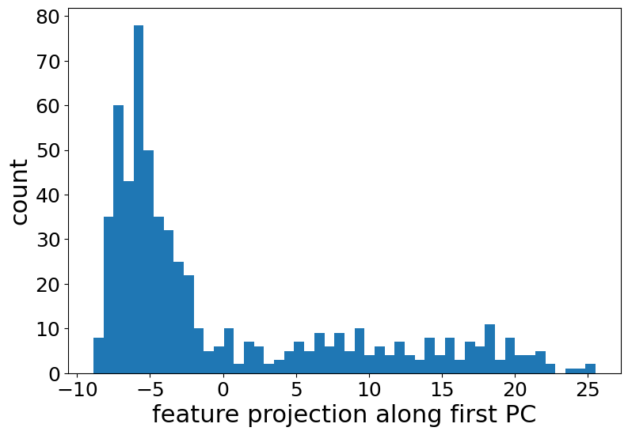

# Clustering in Feature Space
Obtaining pixel-wise annotations for training a semantic segmentation model is expensive and time-consuming. Additionally, prior knowledge of all objects to be classified is required and it is not always available. Therefore, in my Bachelor's thesis, I explored using a pretrained image *classification* model (VGG16) for the purpose of object identification/image segmentation. The core idea is to extract a deep feature representation of the input image and cluster the pixel-wise entries in the extracted tensor.
 
As shown in the image below, the segmentation mask can distinguish between the objects in the image.

  

The image below shows a grayscale representation of the feature projections along the first principal component. It clearly shows the separation between the foreground and the background in the image (as shown by the two peaks in the histogram).
 
  

### Usage:
`python3 main.py image`
